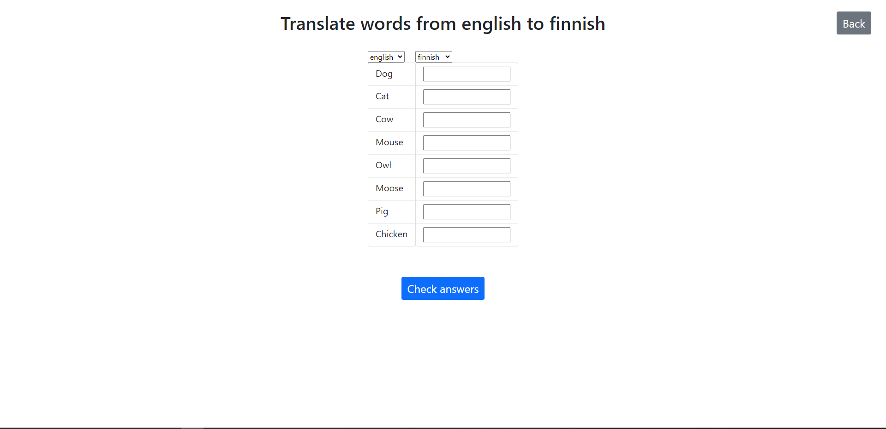
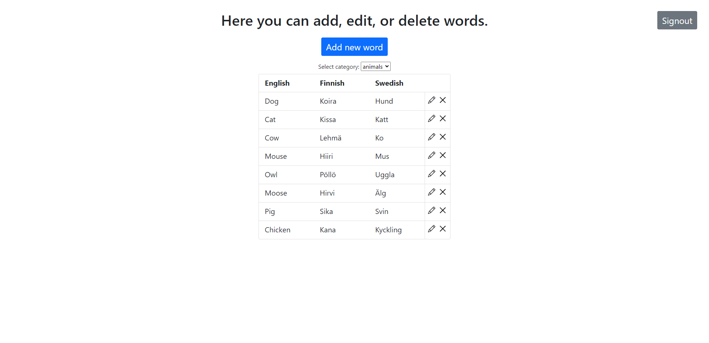

# Word Quiz
This project is a language learning app where user can practice words  
from different categories in English, Finnish and Swedish.  
This app is hosted at https://qmalhy-word-quiz.herokuapp.com/

# Motivation
This app was created for my backend studies at Tampere University of Applied Sciences.

# Screenshots

# Tech/Framework used
Frontend: https://reactjs.org/  
Backend: https://nodejs.org/en/  
         https://www.npmjs.com/package/express

# Features
There are five different categories of words (ex. food, colors) 
in three different languages, that the user can practice with.
The user can also add, edit or delete words in the Teacher view.

# Installation
1. Copy and unpack the project
2. Open command prompt and go into fullstack-project-2021-main and insert command npm install
3. Go to fullstack-project-2021-main/frontend and insert command npm install and then npm run-scripts build
4. Go back to fullstack-project-2021-main and create a .env file which contains needed env keys in db.js
5. Insert command nodemon index.js
6. Navigate to localhost:8080 in your browser

# How to use
HOW TO PLAY  
Go to the user view and select you category. Check which languages are selected and insert the words in the language asked.  
CHANGE LANGUAGES  
Click the drop-down menu on top of a list and select a new language  
ADD NEW WORD  
Click the add new word button in teacher view and enter word in all languages  

EDIT WORD  
Click the pen icon next to the word in teacher view  

DELETE WORD  
Click the X icon next to the word  
SELECT CATEGORY  
In student view, click a category name  

In teacher view, select category from the drop-down menu  

# License
MIT © Aleksi Hyttinen
